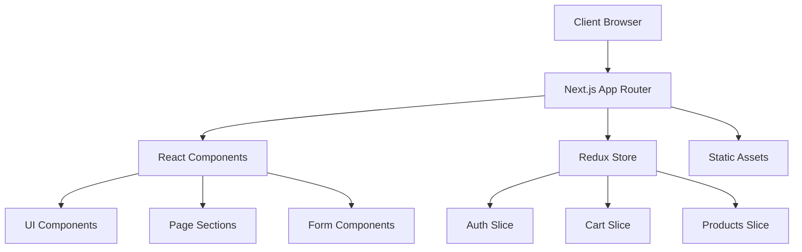
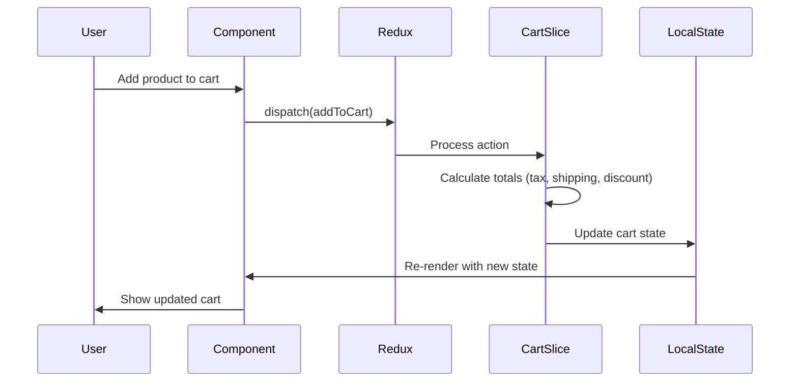

# PROJECT AUDIT: Olwen Lifesciences Pharmaceutical E-commerce Platform

## 1. Executive Summary

**What this app is**: Olwen Lifesciences is a comprehensive pharmaceutical e-commerce platform built with Next.js 15.5.0, serving as a digital pharmacy solution for customers to browse, purchase, and manage prescription and over-the-counter medications.

**Who it serves**: Healthcare consumers seeking convenient access to pharmaceutical products, with features supporting both prescription and non-prescription medication purchases.

**Key features**: 
- Product catalog with detailed pharmaceutical information
- Shopping cart with prescription upload capabilities
- User authentication and account management
- Admin dashboard for product and order management
- Responsive design with medical-themed UI

**High-level stack**: 
- **Frontend**: Next.js 15.5.0 (App Router), React 19.1.0, TypeScript 5
- **Styling**: Tailwind CSS 4, Custom CSS with medical color palette
- **State Management**: Redux Toolkit with React-Redux
- **UI Components**: Custom component library with Headless UI, Lucide React icons
- **Animations**: Framer Motion
- **Forms**: React Hook Form with Zod validation
- **Build**: Turbopack (Next.js experimental bundler)

**How to run it locally**: Install dependencies with `npm install`, then run `npm run dev --turbopack` to start the development server on http://localhost:3000.

**How it's deployed**: Configured for Vercel deployment (standard Next.js deployment pattern), with build command `npm run build --turbopack` and start command `npm start`.

## 2. Architecture Overview

### High-Level Architecture


### Data Flow for Cart Feature


### Routing Architecture
- **Mode**: App Router (Next.js 13+ file-based routing)
- **Layout Strategy**: Root layout with Navigation and Footer components
- **Nested Routes**: Admin section has its own layout (`src/app/admin/layout.tsx`)
- **Dynamic Routes**: Product detail pages (`src/app/products/[id]/page.tsx`)
- **Server/Client Components**: Mixed approach with client components for interactive features

### State Management
- **Primary**: Redux Toolkit with three main slices:
  - `authSlice`: User authentication and profile data
  - `cartSlice`: Shopping cart state with prescription handling
  - `productsSlice`: Product catalog and filtering
- **Local State**: React useState for component-specific state
- **Form State**: React Hook Form for form management

### API Layer
- **Pattern**: Currently using mock data and local state
- **Structure**: Prepared for API integration with typed interfaces
- **Location**: Type definitions in `src/lib/types.ts`

### Build System
- **Bundler**: Turbopack (Next.js experimental bundler)
- **TypeScript**: Full TypeScript setup with strict mode
- **Styling**: Tailwind CSS 4 with PostCSS processing
- **Linting**: ESLint with Next.js configuration

## 3. Feature Inventory

| Feature | User Role(s) | Route(s)/Endpoint(s) | Main Components | Data Sources | Notable Libraries | File References |
|---------|-------------|---------------------|-----------------|--------------|------------------|-----------------|
| Homepage | All Users | `/` | Hero, FeaturedProducts, Categories, TrustSafety, FAQ | Mock data | Framer Motion | `src/app/page.tsx`, `src/components/sections/*` |
| Product Catalog | All Users | `/products` | ProductCard, ProductFilters | Redux products slice | Lucide React | `src/app/products/page.tsx` |
| Product Details | All Users | `/products/[id]` | ProductDetailDialog | Redux products slice | - | `src/app/products/[id]/page.tsx` |
| Shopping Cart | All Users | Global component | ShoppingCart | Redux cart slice | Redux Toolkit | `src/components/cart/shopping-cart.tsx` |
| User Authentication | Users | `/login`, `/register` | Auth forms | Redux auth slice | React Hook Form, Zod | `src/app/login/page.tsx`, `src/app/register/page.tsx` |
| User Account | Authenticated | `/account` | Account management | Redux auth slice | - | `src/app/account/page.tsx` |
| Checkout | Authenticated | `/checkout` | Checkout form | Redux cart slice | React Hook Form | `src/app/checkout/page.tsx` |
| Admin Dashboard | Admin | `/admin` | Admin layout, product management | Redux products slice | - | `src/app/admin/*` |
| Contact Form | All Users | `/contact` | ContactForm | Local state | React Hook Form | `src/app/contact/page.tsx` |

### UX Notes and Edge Cases
- **Prescription Handling**: Cart supports prescription file uploads for prescription medications
- **Tax Calculation**: Automatic 8% tax calculation with free shipping over $50
- **Coupon System**: Built-in coupon codes (WELCOME10, SAVE20) with percentage discounts
- **Responsive Design**: Mobile-first approach with medical-themed color palette
- **Trust Indicators**: FDA approval badges, licensed pharmacy indicators

## 4. Routing Map

| Path | File | Component Type | Dynamic Params | Metadata | Middleware |
|------|------|---------------|----------------|----------|------------|
| `/` | `src/app/page.tsx` | Server | - | Root metadata | - |
| `/about` | `src/app/about/page.tsx` | Server | - | - | - |
| `/products` | `src/app/products/page.tsx` | Server | - | - | - |
| `/products/[id]` | `src/app/products/[id]/page.tsx` | Server | `id` | - | - |
| `/login` | `src/app/login/page.tsx` | Client | - | - | - |
| `/register` | `src/app/register/page.tsx` | Client | - | - | - |
| `/account` | `src/app/account/page.tsx` | Client | - | - | - |
| `/checkout` | `src/app/checkout/page.tsx` | Client | - | - | - |
| `/contact` | `src/app/contact/page.tsx` | Client | - | - | - |
| `/admin` | `src/app/admin/page.tsx` | Client | - | - | - |
| `/admin/products` | `src/app/admin/products/page.tsx` | Client | - | - | - |
| `/admin/orders` | `src/app/admin/orders/page.tsx` | Client | - | - | - |
| `/admin/inquiries` | `src/app/admin/inquiries/page.tsx` | Client | - | - | - |

**Note**: No middleware.ts file detected. No custom rewrite/redirect rules in next.config.ts.

## 5. Packages & What They Do (Dependency Map)

| Package | Version | Category | What it does here | Where used | Key config files |
|---------|---------|----------|------------------|------------|------------------|
| next | 15.5.0 | Framework | Core React framework with App Router | Throughout app | `next.config.ts` |
| react | 19.1.0 | Framework | UI library | All components | - |
| react-dom | 19.1.0 | Framework | DOM rendering | Root layout | - |
| typescript | ^5 | Build | Type checking and compilation | All .ts/.tsx files | `tsconfig.json` |
| @reduxjs/toolkit | ^2.8.2 | State | State management with Redux | `src/store/*` | - |
| react-redux | ^9.2.0 | State | React bindings for Redux | Components using state | - |
| tailwindcss | ^4 | UI | Utility-first CSS framework | All components | `postcss.config.mjs` |
| @tailwindcss/postcss | ^4 | Build | PostCSS plugin for Tailwind | Build process | `postcss.config.mjs` |
| framer-motion | ^12.23.12 | UI | Animation library | Hero, Navigation | - |
| @headlessui/react | ^2.2.7 | UI | Unstyled accessible UI components | Dialog components | - |
| lucide-react | ^0.541.0 | UI | Icon library | Throughout UI | - |
| react-hook-form | ^7.62.0 | Forms | Form state management | Contact, auth forms | - |
| @hookform/resolvers | ^5.2.1 | Forms | Form validation resolvers | With Zod validation | - |
| zod | ^4.1.1 | Validation | Schema validation | Form validation | - |
| class-variance-authority | ^0.7.1 | UI | CSS class variance utility | UI components | - |
| clsx | ^2.1.1 | UI | Conditional className utility | UI components | - |
| tailwind-merge | ^3.3.1 | UI | Tailwind class merging utility | UI components | - |
| eslint | ^9 | Quality | JavaScript/TypeScript linting | All source files | `eslint.config.mjs` |
| eslint-config-next | 15.5.0 | Quality | Next.js ESLint configuration | Linting setup | `eslint.config.mjs` |

## 6. Configuration & Conventions

### TypeScript Configuration (`tsconfig.json`)
- **Target**: ES2017 with modern library support
- **Module Resolution**: Bundler mode for Next.js compatibility
- **Path Mapping**: `@/*` maps to `./src/*` for clean imports
- **Strict Mode**: Enabled for type safety

### ESLint Configuration (`eslint.config.mjs`)
- **Extends**: Next.js core web vitals and TypeScript configurations
- **Ignores**: Standard build directories and generated files

### PostCSS Configuration (`postcss.config.mjs`)
- **Plugins**: Only Tailwind CSS PostCSS plugin

### Next.js Configuration (`next.config.ts`)
- **Minimal Configuration**: Default settings with no custom modifications

### Environment Variables
- **Status**: No .env files detected in repository
- **Expected Variables**: Likely needs API endpoints, database URLs, authentication secrets for production

### Module Aliasing
- **@/**: Maps to `src/` directory for clean imports throughout the application

## 7. Data & Auth

### Authentication Strategy
- **Implementation**: Redux-based auth state management
- **Storage**: Local Redux store (no persistence detected)
- **Protected Routes**: Admin routes require authentication
- **Session Management**: Client-side state only

### Database/ORM
- **Current State**: No database integration detected
- **Data Source**: Mock data and local state
- **Schema**: Comprehensive TypeScript interfaces in `src/lib/types.ts`

### External APIs
- **Current State**: No external API integrations detected
- **Prepared For**: RESTful API integration with typed responses

### Caching
- **Strategy**: No explicit caching strategy implemented
- **Potential**: Next.js built-in caching for static assets

## 8. Testing, Quality, and DX

### Testing Frameworks
- **Status**: No test frameworks detected
- **Missing**: Unit tests, integration tests, e2e tests

### Lint/Format Commands
- **Available Scripts**:
  - `npm run lint`: ESLint checking
  - `npm run dev`: Development server with Turbopack
  - `npm run build`: Production build with Turbopack
  - `npm start`: Production server

### Pre-commit Hooks
- **Status**: No Husky or lint-staged configuration detected

### CI Pipelines
- **Status**: No GitHub Actions or other CI configuration detected

## 9. Build & Deployment

### Build Process
- **Development**: `npm run dev --turbopack` (Turbopack bundler)
- **Production**: `npm run build --turbopack` followed by `npm start`
- **Artifacts**: `.next` directory with optimized bundles

### Environment Targets
- **Development**: Local development with hot reload
- **Production**: Optimized build for deployment

### Deployment Provider
- **Target**: Vercel (standard Next.js deployment)
- **Configuration**: Default Vercel settings

## 10. Gaps, Risks, and Next Steps

### Missing Documentation
- **API Documentation**: No API endpoint documentation
- **Component Documentation**: No Storybook or component docs
- **Deployment Guide**: Basic README with minimal setup instructions

### Fragile Areas
- **No Database**: Currently using mock data, needs backend integration
- **No Authentication Backend**: Client-side auth state only
- **No Error Handling**: Limited error boundaries and API error handling
- **No Testing**: Zero test coverage

### TODOs/FIXMEs Discovered
- **Navigation Component**: Commented out blog link (line 32 in navigation.tsx)
- **Mock Data**: All product and user data is hardcoded

### Upgrade Suggestions
- **Add Testing**: Jest, React Testing Library, Playwright for e2e
- **Add Backend**: API routes or external backend service
- **Add Database**: PostgreSQL with Prisma or similar ORM
- **Add Authentication**: NextAuth.js or similar solution
- **Add Error Handling**: Error boundaries and proper error states

### Quick Wins
- **Performance**: Add loading states and skeleton components
- **Accessibility**: Add ARIA labels and keyboard navigation
- **Security**: Add input validation and sanitization
- **SEO**: Add proper meta tags and structured data

## Detected Versions
- **Node.js**: v23.11.1
- **npm**: 11.4.2
- **Next.js**: 15.5.0

## Key Folder Structure
```
src/
├── app/                 # Next.js App Router pages
│   ├── admin/          # Admin dashboard pages
│   ├── products/       # Product catalog and details
│   └── [other-pages]/  # Static pages (about, contact, etc.)
├── components/         # React components
│   ├── cart/          # Shopping cart components
│   ├── forms/         # Form components
│   ├── layout/        # Navigation and footer
│   ├── sections/      # Page sections (hero, featured, etc.)
│   └── ui/            # Reusable UI components
├── lib/               # Utilities and types
└── store/             # Redux store and slices
```

## Available Scripts
- `npm run dev`: Start development server with Turbopack
- `npm run build`: Build for production with Turbopack
- `npm start`: Start production server
- `npm run lint`: Run ESLint

## How to Extend This Codebase

1. **Add a New Page with Data Fetching**: Create a new file in `src/app/[page-name]/page.tsx`, define the component, and add navigation link in `src/components/layout/navigation.tsx`.

2. **Add a Protected API Route**: Create `src/app/api/[endpoint]/route.ts`, implement GET/POST handlers, and add authentication middleware.

3. **Add a New Database Table + Migration**: Install Prisma, create schema in `prisma/schema.prisma`, run migrations, and update TypeScript types in `src/lib/types.ts`.

4. **Introduce E2E Tests**: Install Playwright, create `tests/` directory, write test specs, and add test scripts to package.json.

5. **Add Real Authentication**: Install NextAuth.js, configure providers in `src/app/api/auth/[...nextauth]/route.ts`, and update auth slice.

6. **Add Form Validation**: Use existing Zod schemas, integrate with React Hook Form, and add error handling components.

7. **Add Loading States**: Create skeleton components in `src/components/ui/`, implement Suspense boundaries, and add loading.tsx files.

8. **Add Error Handling**: Create error.tsx files for error boundaries, implement try-catch in async operations, and add toast notifications.

9. **Add Search Functionality**: Implement search in products slice, add search API endpoint, and create search results page.

10. **Add Real-time Features**: Integrate WebSocket or Server-Sent Events for order updates, inventory changes, and notifications.
